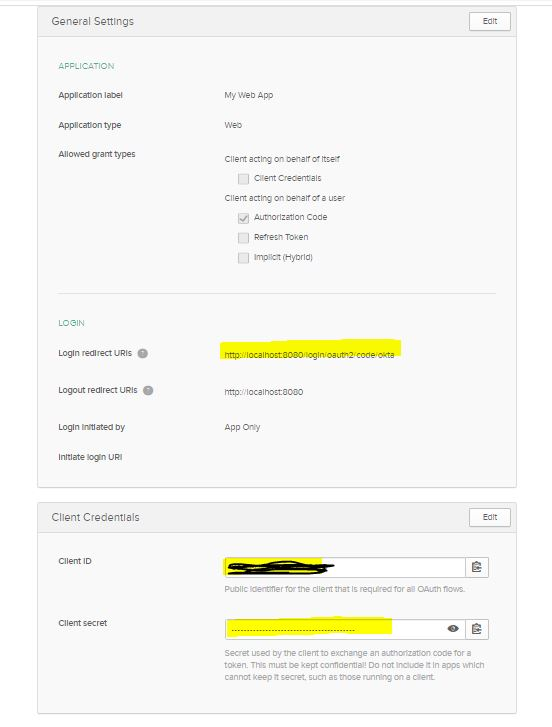
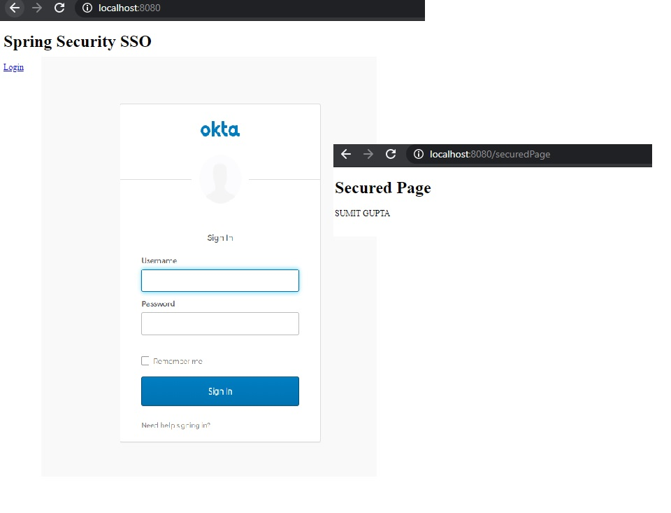

# Getting Started

### Register your api in okta after creating account in https://developer.okta.com/

### update application.yml

    issuer: https://<<OKTA-DOMAIN>>/oauth2/default
    client-id: <<CLIENT-ID>>
    client-secret: <<CLIENT-SECRET>>

### Start application on localhost:8080

